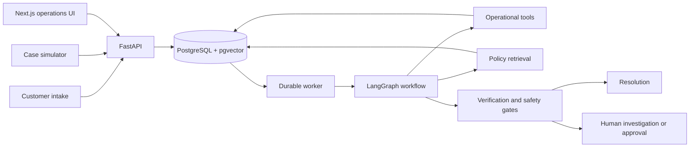

# Luma Agentic Case Resolution

Luma is a production-minded case-resolution system for a synthetic service business. It accepts
customer complaints, investigates authoritative operational records, retrieves the policy version
that applied at the time of the event, proposes a resolution, verifies that proposal, and either
resolves the case safely or routes it to a human.

[View the project presentation](presentation.pdf)

## What it demonstrates

- A bounded LangGraph workflow with typed planning, investigation, policy, proposal, and
  verification stages.
- Read-only operational tools that preserve customer scope and attach source provenance.
- Hybrid policy retrieval over versioned policy sections using PostgreSQL and pgvector.
- Deterministic evidence checks, action validation, approval interrupts, and idempotent execution.
- Durable PostgreSQL jobs, worker leases, checkpoint resume, audit history, and SSE updates.
- An authenticated Next.js operations dashboard and a separate customer intake experience.
- Synthetic enterprise data, a standalone case simulator, and model-free and live-model evals.

## Architecture



The workflow is deliberately bounded: investigation allows at most eight operational tool calls,
and policy assessment can request only one supplemental lookup. Operational facts, policy rules,
workflow checkpoints, and evaluation truth remain separate sources of data.

See [docs/ARCHITECTURE.md](docs/ARCHITECTURE.md) for detailed runtime and sequence diagrams.

## Technology

- Python 3.12, FastAPI, Pydantic, SQLAlchemy, and Alembic
- LangGraph with PostgreSQL checkpointing
- PostgreSQL 16 with pgvector
- Anthropic, Google Gemini, and OpenRouter model adapters
- Next.js 16, React 19, and TypeScript
- pytest, Ruff, mypy, and GitHub Actions
- Docker Compose for the complete local stack

## Quick start with Docker

Prerequisites: Docker Desktop and Docker Compose.

1. Create your local environment file:

   ```powershell
   Copy-Item .env.example .env
   ```

2. Add the credential for the model provider selected in `.env`. Anthropic uses
   `ANTHROPIC_API_KEY`; Gemini and OpenRouter use `LUMA_MODEL_API_KEY`.

3. Build the images and initialize the database:

   ```powershell
   docker compose build
   docker compose run --rm setup
   ```

4. Start the application:

   ```powershell
   docker compose up -d
   ```

Open these local endpoints:

- Operations dashboard: <http://localhost:3000/login>
- Customer intake: <http://localhost:3000/submit>
- API health check: <http://localhost:8000/health>

The default development operations login comes from `.env.example`:

```text
Username: operations
Password: change-me-before-production
```

Change these credentials outside local development. The application refuses the default password
when configured for production.

Use `docker compose down` to stop the services. PostgreSQL data remains in the named volume; add
`-v` only when you intentionally want to delete that data.

## Local development

Prerequisites: Python 3.12 or 3.13, [uv](https://docs.astral.sh/uv/), Docker Desktop,
Node.js 24, and npm.

Install the Python environment and start PostgreSQL:

```powershell
Copy-Item .env.example .env
uv sync --dev
docker compose up -d postgres
```

Initialize the application:

```powershell
uv run alembic upgrade head
uv run luma-generate-enterprise
uv run luma-index-policies
uv run luma-bootstrap
uv run luma-agent --setup-checkpoints
```

Run the backend services in separate terminals:

```powershell
uv run luma-api
uv run luma-worker
```

Run the frontend:

```powershell
Set-Location web
npm install
npm run dev
```

## Configuration

The main settings are documented in [`.env.example`](.env.example):

| Setting | Purpose |
| --- | --- |
| `LUMA_DATABASE_URL` | PostgreSQL connection used by the Python services |
| `LUMA_MODEL_PROVIDER` | `anthropic`, `google_genai`, or `openrouter` |
| `LUMA_MODEL_NAME` | Provider model identifier |
| `LUMA_AGENT_MAX_TOOL_CALLS` | Investigation call limit |
| `LUMA_AGENT_MAX_SUPPLEMENTAL_CALLS` | Policy-requested supplemental lookup limit |
| `LUMA_OPERATIONS_USERNAME` / `LUMA_OPERATIONS_PASSWORD` | Local operations account |

The default test suite uses deterministic model doubles and does not call an external model.
Commands using `--live` require provider credentials and may incur cost.

## Testing

Run the Python quality checks and tests:

```powershell
uv run ruff format --check src tests migrations
uv run ruff check src tests migrations
uv run mypy src
uv run pytest -q
```

Database-backed tests are opt-in:

```powershell
docker compose up -d postgres
$env:RUN_DB_TESTS = "1"
uv run pytest -m "not live_model" -q
```

Run the frontend checks:

```powershell
Set-Location web
npm run lint
npm run build
```

## Evaluation and simulation

Validate the versioned evaluation dataset without calling a model:

```powershell
uv run luma-eval
```

Run live development cases before the held-out split:

```powershell
uv run luma-eval --live --split development
uv run luma-eval --live --split held_out
```

Submit a bounded stream of representative cases through the normal intake API:

```powershell
uv run luma-simulator --count 5
```

## Repository map

| Path | Contents |
| --- | --- |
| `src/luma/agents` | Workflow graph, contracts, prompts, model adapters, and tool execution |
| `src/luma/api` | FastAPI routes and response schemas |
| `src/luma/services` | Case, job, action, communication, and recommendation services |
| `src/luma/retrieval` | Policy indexing and hybrid retrieval |
| `synthetic_enterprise` | Synthetic business specification and deterministic data builder |
| `web` | Next.js operations and customer interfaces |
| `tests` | Unit, integration, and data-integrity coverage |
| `evals` | Versioned evaluation cases, graders, and reports |
| `docs` | Architecture, decisions, demo guide, and production-readiness review |

## Further documentation

- [Demo runbook](docs/DEMO_RUNBOOK.md)
- [Production readiness](docs/PRODUCTION_READINESS.md)
- [Evaluation report](docs/EVALUATION_REPORT.md)
- [Agent workflow decision](docs/decisions/M6_AGENT_WORKFLOW.md)
- [Verification and action safety](docs/decisions/M7_VERIFICATION_AND_ACTION_SAFETY.md)
- [Operations UI decision](docs/decisions/M9_OPERATIONS_UI.md)
- [Synthetic business specification](synthetic_enterprise/business_spec/README.md)

## Scope and safety

This is a demonstration system, not a production customer-support deployment. It uses synthetic
data and a single operations account. Mutating recommendations require explicit approval,
target-state revalidation, and idempotency checks. See
[docs/PRODUCTION_READINESS.md](docs/PRODUCTION_READINESS.md) for known limitations and required
hardening.
