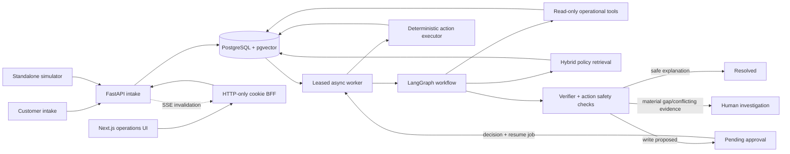

# Runtime Architecture

This view describes the implemented system, not an aspirational cloud diagram.



## One case, including the bounded loop

```mermaid
sequenceDiagram
    participant Q as PostgreSQL job queue
    participant M as Case manager
    participant I as Investigation component
    participant K as Policy component
    participant V as Verifier
    participant H as Human operator
    participant A as Action executor

    Q->>M: Claimed case and trusted customer scope
    M->>I: Typed objectives and untrusted customer category hint
    loop Until evidence complete or eight calls
        I->>I: Choose one read-only tool from current evidence
        I->>I: Execute and observe provenanced result
    end
    I-->>M: Provenanced evidence + advisory coverage
    M->>K: Category, event date, query, evidence
    K-->>M: Effective policy sections + applicability
    opt Policy identifies one missing evidence type
        M->>I: One supplemental read-only call
        I-->>M: Additional evidence
        M->>K: Reassess once
        K-->>M: Final policy assessment
    end
    M->>M: Grounded resolution proposal; assess gap materiality
    M->>V: Complaint + evidence + policy + exact proposal
    V-->>M: Supported, gaps, contradictions, disposition
    alt Human investigation
        M-->>Q: Persist reason and terminal escalation
    else Safe read-only resolution
        M-->>Q: Persist resolution
    else Mutating action
        M-->>H: Frozen command and before-state
        H-->>Q: Durable approve/reject decision + resume job
        Q->>A: Resume checkpoint
        A->>A: Reauthorize, revalidate, deduplicate
        A-->>Q: Receipt or fail-closed escalation
    end
```

There is no unbounded conversation among agents. The investigator's observe-and-act loop is capped
at eight calls, and policy may request one supplemental evidence pass. Retries, job recovery, and
approval resume are workflow lifecycle behavior, not extra autonomous reasoning.

## Sources of truth

- Externally owned PostgreSQL `business` tables: operational facts. They are generated by the
  standalone `synthetic_enterprise` project only for this demonstration.
- Versioned policy sections: business rules effective on a material event date.
- Application artifact tables: plans, evidence, retrievals, proposals, verification,
  actions, and audit history.
- LangGraph checkpoint tables: execution position only; never the business record.
- Versioned eval files/private manifests: builder-only ground truth.

The dashboard renders application artifacts and never reads checkpoints or eval
truth. The simulator only calls intake and can be removed without changing runtime
behavior.
