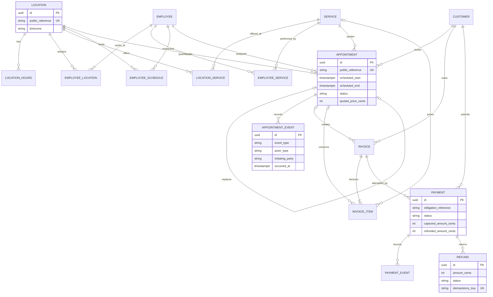
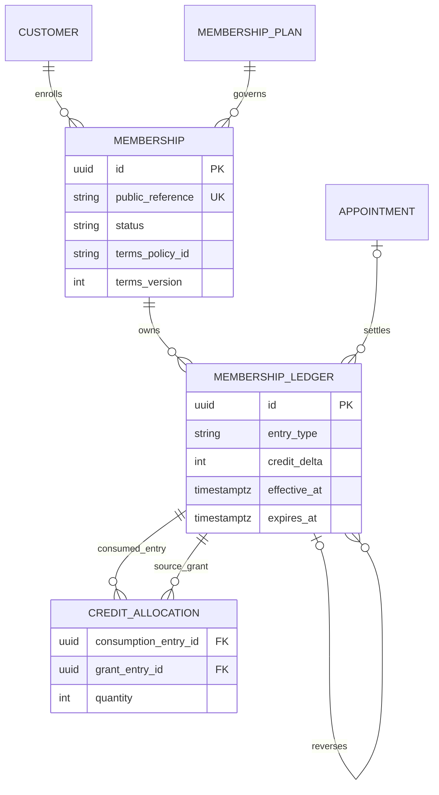
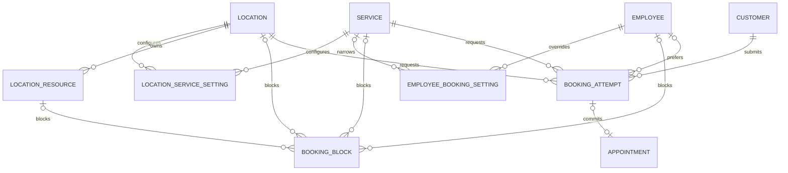
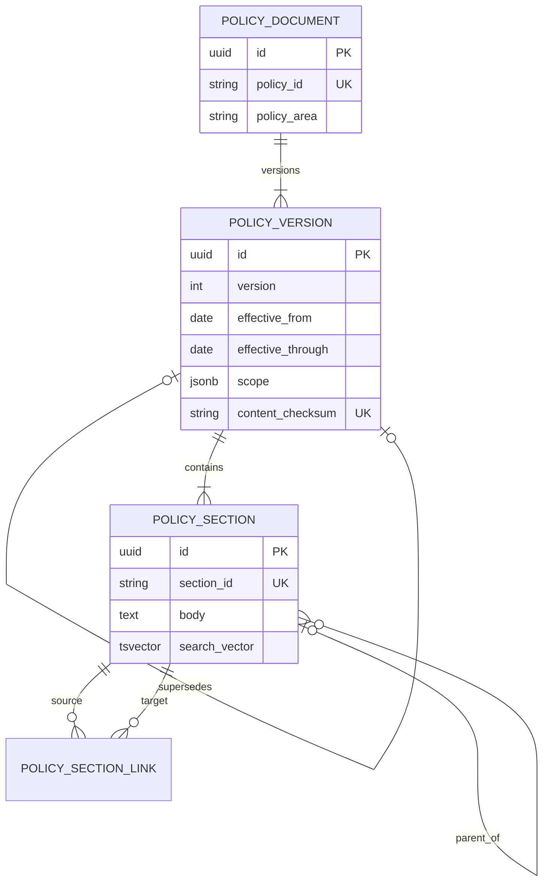

# Luma Wellness Entity Relationship Diagram

Status: Draft for Gate B schema review

The diagrams emphasize ownership and evidence flow. UUID primary keys and ordinary
timestamp columns are omitted from boxes for readability.

## Organization, appointments, and billing

## Memberships

## Booking availability

## Policy knowledge

